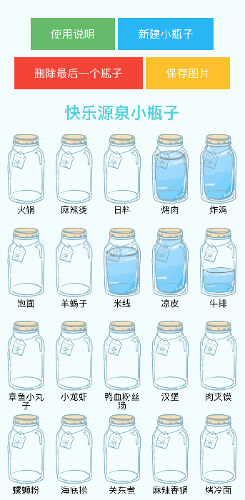

Create the famous happy bottles
======

## DEMO
You can visit https://boka.noddl.me to have a online try.

## Features
1. Edit name of bottle
2. Create a new bottle
3. Edit title of picture

## Screenshots

部署流程：
1. 准备boka项目，克隆boka项目到你的服务器上：
git clone https://github.com/dbdoer/boka
cd boka

2. 构建前端项目
由于项目是一个基于TypeScript的网页应用，你需要先编译前端项目。确保你的服务器上已经安装了Node.js和npm，然后运行：
npm install
npm run build
这将在build目录下生成编译后的前端文件。

3. 构建Docker镜像
在boka项目目录下运行：

docker build -t boka .

这将创建一个名为boka的Docker镜像。

4. 运行Docker容器
运行以下命令启动Docker容器：

docker run -d -p 8900:80 --name boka-container boka

这将启动一个名为boka-container的Docker容器，并将容器的80端口映射到服务器的8900端口。

注意修改：
1. 执行：
boka/.env.production
PUBLIC_URL=https://bbq.noddl.me/static/boka
为...我改的是PUBLIC_URL=/bottle/

2.执行：
nano .dockerignore
修改为：
.idea
src/*
!src/assets
node_modules

3. 修改/boka/src/constans.ts
export const KindsURL = 'http://xxxxx:8900/assets/names.json'
export const BottleImageURL = 'http://xxxxx:8900/assets/images'

